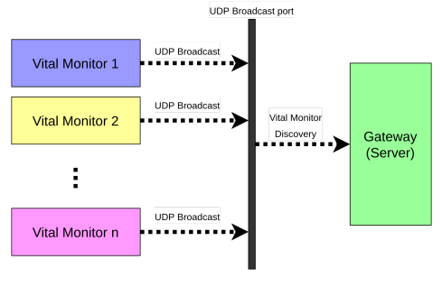
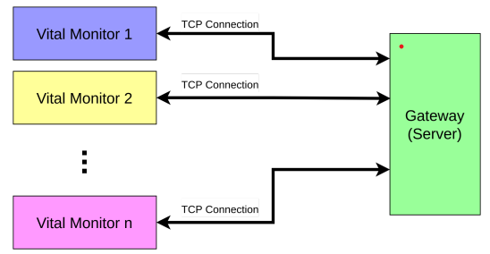

# Vital Monitor System-Operating Systems

**Aim:** This projectaims to gethands-onexperienceinareal-worldscenario.Youwill
requiretheknowledgeofnetworking,operatingsystems,andprogrammingtocomplete
this project.

**Background:** Thisprojectisbasedonareal-lifescenario.Inahospital,therewillbea
numberofpatientswhose _vitals_ (thingslikeheartrate,bloodpressure,etc.)shouldbe
monitored.Eachpatientwouldbeconnectedtoavitalmonitorandthesemonitorswill
transmitthevitalinformationoveranetworktoacentrallocation.Thatwaynursingstaff
willbe ableto monitor many patientsand do itremotely–whichisusefulwhenthe
patients are contagious.

**Specifications:** There will be a set of vital monitors running. Each of these vital
monitorswillhaveanIPaddress.Thesevitalmonitorswillberunningonaserver.Vital
monitors will broadcast their identity to a specificUDP port inthe followingformat:
<ip_addr, port, monitor_id>.
 

 

##Implement path.
1) Implement a gateway that discovers all of these vital monitors.
2) Foreachdiscoveredmonitor,thegatewayshouldinitiateaTCPconnectionwith
thevitalmonitor.ItshouldusethediscoveredportnumberandIPaddressforthis
connection. ThisTCP connectionwill be usedto receivevitalinformationand
alarms from vital monitors.
 

 

3) Consider thread synchronization where appropriate and implement thread
synchronizations in your gateway implementation.

**included:** 
● Design and Architecture 
● Correct functionality 
● Code quality and good coding practices 
● Error handling 
● Synchronization 

